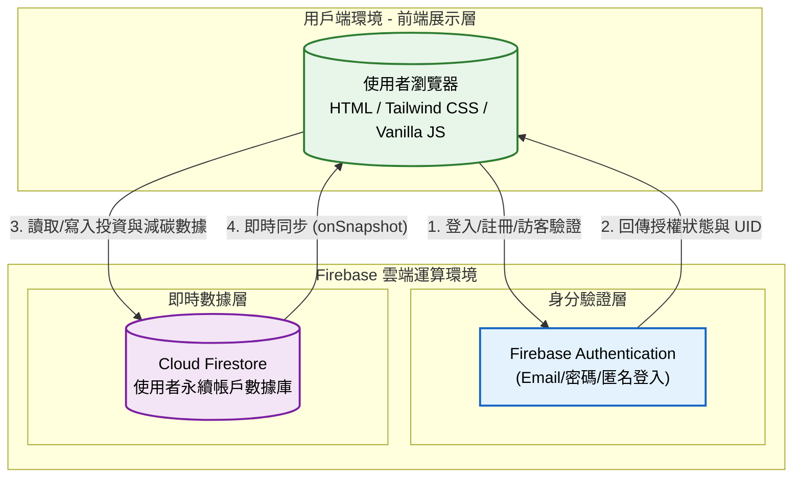

# 碳吉 TanJi：淨零群募平台 🌿

## 1. 專案介紹

### 1.1 系統目的簡介

本系統旨在打造透明、低門檻的綠色金融媒合平台。透過「微型投資試算」與「遊戲化永續回饋（碳吉寶寶）」兩大核心功能，整合數位支付介面與虛實整合獎勵機制，將艱澀的氣候資金缺口與轉型金融，轉化為一般公民皆能輕鬆參與的日常減碳行動，落實普惠金融與氣候正義。

---

## 2. 系統架構與範圍

### 2.1 系統架構圖

本系統採用 **Serverless 無伺服器架構** 設計，前端採純前端框架整合 Tailwind CSS，後端依賴 Firebase 進行身分驗證與資料儲存。



### 2.2 系統範圍

* **展示層**: 採用 Tailwind CSS 建構響應式介面（RWD），包含玻璃擬物化卡片、動態互動面板、跑馬燈與五彩紙屑（Confetti）動畫特效。
* **業務邏輯層**: 負責處理投資金額轉換減碳量（$1000 = 12kg CO2e）、經驗值（EXP）升級算法、每日打卡邏輯與解鎖回饋品機制。
* **數據存取層**: 串接 Firebase Authentication 處理多重登入管道，並利用 Cloud Firestore 儲存使用者的投資總額、碳排減少量、經驗值與等級。

### 2.3 交付項目

1. **網頁應用程式**: `index.html` (單頁式應用，內含完整模組化 JS)。
2. **靜態圖資與多媒體**: 存放於 `assets/` 目錄內之碳吉寶寶圖片（`.png`, `.jpg`）與互動影片（`.mp4`）。
3. **系統規格文件**: 本 `README.md` 規格書。

---

## 3. 業務功能需求

| 需求編號 | 功能名稱 | 參與者 | 功能描述 | 業務邏輯/備註 |
| --- | --- | --- | --- | --- |
| **FR-01** | **永續帳戶授權** | 投資人 | 提供 Email/密碼註冊、登入或「訪客匿名登入」功能，建立專屬帳戶。 | 透過 Firebase Auth 驗證，若斷線或異常則啟動本地（Local）模擬登入備援。 |
| **FR-02** | **微型投資試算** | 投資人 | 拖拉滑桿（Range Slider）或手動輸入，即時試算單次贊助的減碳貢獻與獲取經驗值。 | 運算公式：每贊助 1,000 元相當於減少 12kg 碳排；每 10 元獲取 1 EXP。 |
| **FR-03** | **多元支付模擬** | 投資人 | 提供信用卡、行動支付、超商代碼、電子錢包等支付選項介面。 | 完成支付後觸發前端 Confetti 動畫，並將數據寫入 Firestore。 |
| **FR-04** | **日常永續打卡** | 投資人 | 點擊按鈕進行每日任務打卡，獲取微量 EXP 並與碳吉寶寶互動。 | 打卡後獲得 5 EXP，介面切換動態 MP4 影像，當日限制單次觸發。 |
| **FR-05** | **里程碑回饋解鎖** | 系統 | 依據累積的總經驗值，自動解鎖對應的虛實整合獎勵。 | 門檻設定：100 EXP (數位徽章)、300 EXP (咖啡券)、800 EXP (環保杯)。 |
| **FR-06** | **個人/平台影響力報告** | 投資人/系統 | 可檢視個人總減碳量、等級；另提供全站總募集資金、參與人數與減碳達成率。 | 運用視覺化進度條與模態框（Modal）呈現即時數據與狀態。 |

---

## 4. 非業務功能需求

### 4.1 安全性要求

* **權限控管**: 依賴 Firebase 安全規則（Security Rules）保護使用者個人投資與 EXP 數據不被越權竄改。
* **本地沙盒備援**: 若外部 API (Firebase) 發生阻擋或異常，系統可自動降級為本地端物件狀態暫存（In-memory storage），確保功能可持續體驗。

### 4.2 系統效能

* **前端渲染**: 採用 Tailwind CSS CDN 與 CSS 原生動畫（Keyframes），避免過多重量級 JavaScript 函式庫拖慢初始載入速度。
* **響應式設計**: 針對手機端（Mobile-first）優化浮動客服面板、模態框（Modal）視窗與滑動反饋。

### 4.3 可用性與準確性

* **異常處理 (Fallback)**: 若 `assets/` 內的圖片或影片遺失，系統內建 Base64 SVG 的 `onerror` 替換機制，確保畫面不破圖。
* **即時反饋**: 所有狀態變更（打卡、贊助、切換專案）皆須於 0.5 秒內完成前端數據綁定（Data Binding）與畫面更新。

---

## 5. 系統介面設計

### 5.1 API 規格

本系統主要依賴 Firebase Web SDK v10.11.0 進行資料交互。

#### 介面 A: 身分驗證 (Firebase Auth)

* **模組**: `signInWithEmailAndPassword`, `createUserWithEmailAndPassword`, `signInAnonymously`
* **狀態監聽**: `onAuthStateChanged`
* **行為**: 驗證通過後，讀取 `user.uid` 作為資料庫文檔的主鍵。

#### 介面 B: 使用者數據同步 (Cloud Firestore)

* **路徑**: `artifacts/tanji-2026/users/{uid}`
* **操作**:
  * `setDoc`: 寫入或更新個人投資總額、CO2、EXP 與 Level。
  * `onSnapshot`: 建立即時監聽器，確保跨視窗操作時數據保持同步。
* **資料結構 (JSON 格式)**:
```json
{
  "invested": 1500,
  "co2": 18.0,
  "exp": 150,
  "level": 1
}
```

---

## 6. 專案安裝與部署

### 前置需求

* 支援 ES6 模組（`<script type="module">`）的現代瀏覽器 (Chrome, Edge, Safari)。
* Firebase 專案環境 (需啟用 Authentication 與 Cloud Firestore)。

### 部署步驟

1. **取得程式碼**: 將 `index.html` 與相關素材放入專案資料夾。
2. **素材準備**: 於根目錄建立 `assets/` 資料夾，放置以下檔案：
   * `tanjibaby.png` (靜態頭像)
   * `tanjibaby2.jpg` (個人帳戶頭像)
   * `tanjibaby_hi.mp4` (打卡互動影片)
3. **Firebase 設定 (可選)**:
   * 預設程式碼已包含測試用配置檔（`firebaseConfig`）。若要連接至您自己的資料庫，請於 `<script type="module">` 內替換 `firebaseConfig` 變數。
   * 確認您的 Firestore 規則允許客戶端讀寫（測試階段可短暫開啟）。
4. **本機端測試**: 
   * 由於使用 ES6 Module 與 CORS 安全限制，請使用 Live Server 或本地伺服器（如 `python -m http.server` 或 `npx serve`）啟動網頁。
5. **正式發布**: 將專案推送至 GitHub，並透過 GitHub Pages 或 Vercel 等靜態託管服務直接發布即可上線。
