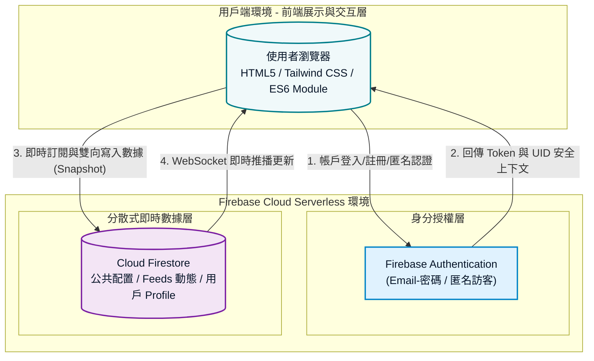

# 碳吉 TanJi：淨零群募平台 🌿

## 1. 專案介紹

### 1.1 系統目的簡介

本系統旨在打造全台首創**透明、低門檻的轉型金融（Transition Finance）群募媒合平台**。

透過「多元淨零專案切換」、「微型投資效益即時試算」、「銀行信託撥款進度牆」與「遊戲化永續成長系統（碳吉寶寶）」等核心模組，結合現代化數位支付展示與去中心化防偽憑證（SHA256 金鑰加密展示），將艱澀的氣候資金缺口與轉型金融，轉化為一般大眾百元即可輕鬆參與的普惠金融行動，杜絕企業「漂綠（Greenwashing）」風險，實踐公正轉型與氣候正義。

---

## 2. 系統架構與範圍

### 2.1 系統架構圖

本系統採用 **Serverless 無伺服器架構** 設計，前端採 Vanilla JS 搭配 Tailwind CSS 進行響應式交互渲染，後端完全對接 Firebase 雲端生態系進行即時數據同步與去中心化驗證。



### 2.2 系統範圍

* **前端展示層（Tailwind CSS / HTML5 / Canvas）**：
* 全站架構採用流暢的單頁式響應式設計（RWD），導入主次分明的高層級視覺架構（Visual Hierarchy）。
* **碳吉寶寶培育艙**：利用放射狀漸層（Radial Gradient）與 CSS 動態浮動（Float Animation）技術模擬智慧溫室光影深度，避免大面積模糊濾鏡，大幅優化行動端滾動流暢度。
* **動態特效模組**：內建 HTML5 Canvas 高效能五彩紙屑（Confetti）粒子物理碰撞系統，於完成專案投資時即時渲染慶祝動畫；每日打卡導入貝茲曲線浮動上升葉片特效（Floating Leaf Animation）。


* **業務邏輯層（ES6 JavaScript）**：
* 負責即時計算專案募資進度百分比、處理打卡防重複限制、計算碳吉寶寶 **5 大階段等級進化論算法**、以及依據不同專案方法學精準換算減碳效益當量與經驗值（EXP）。


* **數據同步與安全層（Firebase Web SDK v10.11.0）**：
* 串接安全授權層，若雲端資料庫連線因故受阻，系統將自動降級（Graceful Degradation）啟動**本地快取沙盒備援（LocalStorage / In-memory storage）**，確保用戶體驗不中斷。


### 2.3 交付項目

1. **網頁應用程式核心**：單頁式高整合原始碼檔案 `index.html`（內含完整模組化 JS 與各視窗 Modal 元件）。
2. **多媒體與圖資資產（Assets Package）**：
* `assets/tanjibaby/`：包含碳吉寶寶各型態靜態圖像（`tanjibaby.png`、`tanjibaby9.png`、`tanjibaby_ceo.png`、`tanjibaby_tech.png`）及打卡動態交互影片（`tanjibaby_hi.mp4`）。
* `assets/projects/`：淨零專案與成功案例縮圖資產（如 `project_solar.png`、`success_hualien.png` 等）。


3. **合規合約文件檔（Docs Mimic）**：包含平台隱私條款、計算方法學說明書、信託契約範本、銀行撥款申請書等四大 PDF 靜態下載路徑。
4. **系統規格說明書**：本 `README.md` 開發者規格文件。

---

## 3. 業務功能需求

| 需求編號 | 功能名稱 | 參與者 | 功能描述 | 業務邏輯 / 核心計量備註 |
| --- | --- | --- | --- | --- |
| **FR-01** | **多重永續帳戶授權** | 投資人 | 提供 Email/密碼註冊與登入。亦支援「訪客匿名登入」，免註冊即刻建立臨時 UID 展開淨零行動。 | 優先介接 Firebase Auth。若遇異常或特定行政帳號（`admin@tanji.com`）則無縫切換至本地快取模擬備援機制。 |
| **FR-02** | **淨零專案調度與試算** | 投資人 | 支援切換全台 5 大淨零計畫。拖拉滑桿或輸入金額，系統即時連動試算該專案對應之減碳量、可得 EXP，並實時放大與加深寶寶培養艙光影。 | **減碳效益當量 ($CO_2e$) 運算公式**：<br>

<br>$$\text{個人減碳效益 (kg } CO_2e\text{)} = \frac{\text{個人參與金額}}{\text{專案目標總額}} \times \text{首年預估總減量當量} \times 1000$$

<br>

<br>**EXP 公式**：每投入 **10 元**即可轉換為 $1\text{ EXP}$。 |
| **FR-03** | **信託金流交付模擬** | 投資人 | 點擊參與跳出信託確認視窗，提供「信用卡繳款」、「行動支付轉帳」、「銀行虛擬帳號」三大信託專戶管道。 | 模擬完成後，金額累計至個人與專案總額，並異步觸發全螢幕 Canvas Confetti 煙火動畫。 |
| FR-04 | **日常永續打卡任務** | 投資人 | 點擊每日打卡，按鈕切換為已完成鎖定狀態，培育艙顯示打卡成功視覺特效。 | 每日限點擊單次。完成可現賺 **5 EXP**，數據即時上傳或寫入快取，並驅動寶寶文字反饋。 |
| **FR-05** | **五階段寶寶等級進化** | 系統 | 依據總 EXP 即時定義用戶等級與碳吉寶寶型態，解鎖不同狀態文字。 | **Lv.1 種子萌發期** ($0\text{+} \text{ EXP}$)<br>

<br>**Lv.2 幼苗展葉期** ($200\text{+} \text{ EXP}$)<br>

<br>**Lv.3 綠意灌木期** ($500\text{+} \text{ EXP}$)<br>

<br>**Lv.4 普惠大樹期** ($1000\text{+} \text{ EXP}$)<br>

<br>**Lv.5 淨零守護神** ($2000\text{+} \text{ EXP}$) |
| FR-06 | **虛實整合里程碑回饋** | 投資人 | 「累積里程碑與回饋專區」會隨經驗值解鎖實體或數位獎勵卡片。 | 達 $100\text{ EXP}$ 解鎖**數位徽章**；達 $300\text{ EXP}$ 解鎖**低碳咖啡券**；達 $800\text{ EXP}$ 解鎖**實體環保杯登記**。未達標點擊則彈出 toast 警示。 |
| **FR-07** | **管理員信託公告主控台** | 管理員 | 特權帳號專屬。可手動調整專案已募金額、勾選人工核收查驗報告（解鎖三階段信託撥款牆），並可發布緊急插播公告至動態牆。 | 後台入口綁定 `admin@tanji.com`，三階段撥款包含：結構安全檢測、設備進場簽收、併網完工營運。 |
| **FR-08** | **碳吉寶寶 AI 智能助手** | 投資人 | 右下角常駐客服對話模組。點擊展開可進行多輪對話，內建精準關鍵字匹配模擬回覆。 | 針對「信託」、「服務費」、「公式/方法學」、「憑證」等氣候金融痛點，提供精準、去漂綠的專業法規學理解答。 |
| FR-09 | **防偽數位憑證下載** | 投資人 | 進入帳戶模態框可切換至「憑證檢視區」，卡片會動態生成專屬編號與 Voucher 條碼。 | 點擊下載可透過 HTML5 Canvas 於背景動態繪製高解析度認證圖，附帶模擬 **SHA256 去中心化安全防偽金鑰明碼**並自動存檔為 `.png`。 |

---

## 4. 非業務功能需求與學理合規

### 4.1 科學化減碳量化機制（計算方法學）

本平台之溫室氣體減量效益數據均具備嚴謹學理基礎，拒絕綠色虛報：

1. **電力減量雙軌制**：電力減量係數嚴格依據經濟部能源署最新劃分標準實施。
* **產業營業用電專案**（如：屋頂太陽能、智慧養殖）：對接**產業電力排碳係數（$0.466\text{ kg CO}_2\text{e/度}$）**。
* **民生公共用電專案**（如：偏鄉節能照明）：對接**民生住宅電力排碳係數（$0.471\text{ kg CO}_2\text{e/度}$）**。


2. **生質沼氣專案**：導入環境部盤查指引方法學，將甲烷（$\text{CH}_4$）之全球暖化潛勢值（GWP）精準折算為二氧化碳當量。
3. **循環經濟專案**：套用網購包裝生命週期評估（LCA）盤查數據，每單次循環使用減少 **$1.2\text{ kg CO}_2\text{e}$**。

### 4.2 嚴謹的金融信託合規架構

1. **專款專用保管**：本平台非金融特許機構，所有群募資金遵循法規全數匯入合作商業銀行信託部進行代收代付保管。
2. **工程進度查核牆**：建立透明的進度查驗機制。提案廠商必須依工程進度，檢具第三方查證報告（技師簽證、材料核實清冊、台電併網公文）送交銀行與平台核收，通過審查始得分批解鎖撥款，100% 杜絕資金挪用風險。
3. **平台媒合收費**：平台不向參與大眾收取任何額外手續費，僅在專案成功達標撥款時，向提案廠商收取 **3% 的轉型媒合服務費**，用以支持物聯網監測對接與信託審查成本。

### 4.3 介面效能優化 (Performance & UX Optimization)

* **渲染流暢度優化**：主動捨棄高耗能的毛玻璃濾鏡（`backdrop-filter`）與全畫面模糊（`blur`），改採純色背景（如 `bg-slate-50`）配合微透明邊框（`border-slate-200/60`）與原生的放射狀漸層，使中低階行動裝置的滑動幀率穩定維持在 **60 FPS**。
* **多媒體延遲載入 (Lazy Loading)**：針對隱藏的動態交互影片（`tanjibaby_hi.mp4`）設定 `preload="none"` 與 `muted playsinline` 屬性，防止網頁初次渲染時耗費頻寬載入未使用資源，優化首屏白畫面時間（FP/FCP）。
* **不破圖防護機制 (Graceful Fallback)**：全面為 `` 標籤配置 `onerror` 事件監聽器，當圖片因路徑或環境遺失時，自動注入內嵌的 **Base64 SVG 向量圖**，確保 UI 視覺不破裂。

---

## 5. 數據庫架構與實時 API 規格

本系統主要依賴 Firebase Web SDK v10.11.0 進行分散式資料交互與實時異步訂閱（onSnapshot）。

### 5.1 Cloud Firestore 數據庫路徑與 JSON 結構

#### 1. 個人永續帳戶 Profile 節點

* **路徑**：`artifacts/{appId}/users/{uid}/profile/data`
* **結構範例**：

```json
{
  "email": "user@example.com",
  "invested": 3500,
  "co2": 42.1,
  "exp": 350,
  "level": 2,
  "role": "user"
}

```

#### 2. 公共專案資產與信託狀態配置節點

* **路徑**：`artifacts/{appId}/public/data/config/projects`
* **結構範例**：

```json
{
  "raisedAmounts": [3451000, 840000, 880000, 420000, 1250000],
  "stages": [
    { "s1": true, "s2": false, "s3": false },
    { "s1": false, "s2": false, "s3": false },
    { "s1": true, "s2": true, "s3": true },
    { "s1": false, "s2": false, "s3": false },
    { "s1": false, "s2": false, "s3": false }
  ]
}

```

#### 3. 即時參與動態牆流水號節點

* **路徑**：`artifacts/{appId}/public/data/feeds`
* **結構範例**：

```json
{
  "name": "台北林先生",
  "action": "參與了 廠房屋頂太陽能建置專案 5,000 元",
  "exp": 500,
  "timestamp": 1780830000000,
  "timeStr": "剛剛"
}

```

---

## 6. 專案安裝與正式部署

### 6.1 前置環境需求

* 支援 ES6 模組標準（`<script type="module">`）之主流現代瀏覽器（Chrome、Edge、Safari）。
* 已啟用的 Firebase Web 專案環境（需開啟 Authentication 匿名/Email 服務與 Cloud Firestore 資料庫）。

### 6.2 部署與啟動步驟

1. **取得程式碼與資源配置**：
將 `index.html` 部署於您的 Web 伺服器根目錄，並確保依據 [2.3 交付項目] 的結構建立 `assets/` 資料夾與相關 PDF 靜態文件。
2. **本地開發沙盒測試**：
由於現代瀏覽器針對 ES6 模組有嚴格的 CORS 安全限制，**不可直接雙擊點開 `.html` 檔案**。請務必使用本地 HTTP 伺服器容器開啟：
* *Node.js* 環境：`npx serve .` 或安裝 VS Code `Live Server` 擴充套件。
* *Python* 環境：`python -m http.server 8000`


3. **Firebase 金鑰對接**：
原始碼內建一組參賽專用測試金鑰。如需更換為專屬生產資料庫，請直接修改 `<script type="module">` 內的 `firebaseConfig` 配置物件。
4. **雲端靜態託管發布**：
本平台屬於純前端 Serverless 架構，可直接一鍵推播發布至 GitHub Pages、Vercel 或 Firebase Hosting 等高效能 CDN 靜態託管服務，即可完成全站正式上線。
